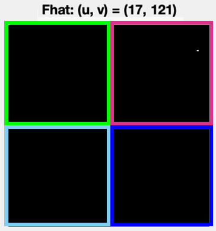

#Answers to questions in Lab 1: Filtering operations

**Name:** Jonathan Rintala                                                       					**Program:** TIEMM, MAIG

**Instructions**: Complete the lab according to the instructions in the notes and respond to the questions stated below. Keep the answers short and focus on what is essential. Illustrate with figures only when explicitly requested.

Good luck!

---


##1.3 Basis functions

**Question 1**: Repeat this exercise with the coordinates p and q set to (5, 9), (9, 5), (17, 9),

(17, 121), (5, 1) and (125, 1) respectively. What do you observe?

**Answers:**

My observations are:

- The placement of the dot determines the waves’ directions

- Distance to origin (upper left corner) from dot, determines the frequency, i.e. a dot close to the origin will yield a lower frequency, which can be observed by waves with longer wavelength, than a dot far away **(if not a multi)**

- Placing a dot on the x-axis yields vertical waves

- Placing a dot on the y-axis yields horizontal waves i.e. (125,1) or (5,1) 

- Placing a dot on other coordinates yields diagonal waves

---

**Question 2**: Explain how a position (p, q) in the Fourier domain will be projected as a sine wave in the spatial domain. Illustrate with a Matlab figure. 

**Answers:**

$Inversion\space theorem: \space F(x) = F^{-1}_D(\hat F)(x) = \frac{1}{N}  \sum\limits_{u \in[0..N-1]^2}[\hat F(u)*e^{\frac{+2\pi iu^T x}N}] \quad(4)$


<div style="text-align:left">


</div>
***Figures*** - Displaying the imaginary part of the projection of the Fourier domain position (5,1) => the spatial domain. Visualizations in 2D resp. 3D.


---

**Question 3**: How large is the amplitude? Write down the expression derived from Equation (4) in the notes. Complement the code (variable amplitude) accordingly.

**Answers:**

- $Inversion\space theorem: \space F(x) = F^{-1}_D(\hat F)(x) = \frac{1}{N}  \sum\limits_{u \in[0..N-1]^2}[\hat F(u)*e^{\frac{+2\pi iu^T x}N}] \quad(4)$

- $Eulers \space formula:\space e^{iw^Tx} = e^{i(w_1x_1+w_2x_2)} = cos(w^Tx) + isin(w^Tx) \quad (5)$


 $From\space (4) => F(m,n) = \frac{1}{\sqrt{M}} \sum\limits_{m=0}^{M-1}[\frac{1}{\sqrt{N}}  \sum\limits_{n=0}^{N-1}[\hat F(u,v)e^{\frac{+2\pi inv}N}]e^{\frac{+2\pi imu}M}] \\ => {\{Euler's \space (5)\} => \\ \frac{1}{\sqrt{M}} \sum\limits_{m=0}^{M-1}[\frac{1}{\sqrt{N}}  \sum\limits_{n=0}^{N-1}[\hat F(u,v) cos(\frac{2\pi n v}{N} + \frac{2\pi m u}{M}) + isin(\frac{2\pi n v}{N} + \frac{2\pi m u}{M})]]]} $


***This gives us:***

- Real part R(z): $\frac{1}{\sqrt{MN}} \sum\limits_{m=0}^{M-1}[ \sum\limits_{n=0}^{N-1}[\hat F(u,v) cos(\frac{2\pi n v}{N} + \frac{2\pi m u}{M})]]$

- Imaginary part Im(z): $\frac{1}{\sqrt{MN}} \sum\limits_{m=0}^{M-1}[ \sum\limits_{n=0}^{N-1}[\hat F(u,v) sin(\frac{2\pi n v}{N} + \frac{2\pi m u}{M})]]$


***From Lecture 3, page 39, the Fourier spectrum is given by:***

- Fourier spectrum: $|F(u,v) |= \sqrt{􏰖Re^2(u,v)+Im^2(u,v)} $


***Followingly, the amplitude A is given by:*** 

- $A = max(\sqrt{R(u,v)^2 + Im(u,v)^2)}$ 


***Since, max of our cosine resp. sine will be = 1:***

- $A = \frac{1}{\sqrt{MN}} max(\sum\limits_{m=0}^{M-1}[ \sum\limits_{n=0}^{N-1} \hat F(u,v)*1)]]$

***Thus, implementation in Matlab:***

```matlab
amplitude = max(abs(Fhat(:)))/sz^2;
```

***Note:*** Matlab's ifft function includes a scaling factor of $1/M^2$ and we 


***Finally, with known values for dimensions and max of Fourier transform we can compute A directly:***

- $M = N = 128$

- $max(\hat F(u,v))$ = 1 (the point that is being placed out has value 1)

- $A = \frac{1}{\sqrt{128^2}}*1 = \frac{1}{128} $


---

**Question 4**: How does the direction and length of the sine wave depend on p and q? Write down the explicit expression that can be found in the lecture notes. Complement the code (variable wavelength) accordingly.

**Answers:**

(1) Wavelength from lecture 03, page 22: $\lambda = \frac{2*\pi}{||(w)||}= \frac{2*{\pi}}{\sqrt{w_1^2 +w_2^2}}$

(2) Phase (angle) of the Fourier transformation, from lecture 03, page 25:

​	$\phi(w_1,w_2) = tan^{−1} \frac{Im(w1,w2)}{Re(w1,w2)}$

(5) Def. from lab description: $w_D = \frac{2*\pi*u}{N}$

- Since we are calculating an angle, we should use the centered coordinates, i.e.
  - u = uc
  - v = vc
- With number of pixels: N = sz

- Thus, we are getting the following expression for lambda using (1) and (5):

  $\lambda = \frac{2*pi}{\sqrt{(\frac{2*pi*uc}{sz})^2} + \sqrt{(\frac{2*pi*vc}{sz})^2}}$

- In MATLAB:

  ```{matlab}
  w_1 = sqrt(2pi*uc)/sz;
  w_2 = sqrt(2pi*vc)/sz;
  wavelength = 2*pi/(w_1^2+w_2^2)
  ```


------

**Question 5**: What happens when we pass the point in the center and either p or q exceeds half the image size? Explain and illustrate graphically with Matlab!

**Answers:**

The Matlab fftshift works as explained by the help function:

```{matlab}
>> help fftshift
	"fftshift Shift zero-frequency component to center of spectrum. /../ For matrices, fftshift(X) swaps the first and third quadrants and the second and fourth quadrants."
```

This moves the default origin of the upper left corner, to instead having the center of the spectrum being the Fourier transform's center; which means we have to calculate the new position of the point **relative to** the new origin of the center. A point (p,q) that has passed the center i.e. having either $p > sz/2$ OR $q > sz/2$ will thus get its position according to:

- $uc = u-1-sz$
- $vc = v -1 - sz$

This can be illustrated with the figures below:

<div>
    
	
</div>

***Figures*** - To the left: Fhat with default origin. To the right: centered Fhat with origin in center of the image.

In the illustrations above, $u<=sz/2$ but $v>sz/2$ which means the position will be calculated as:

- $uc = u-1 = 17-1 = 16$
- $vc = v-1-sz = 121 - 1 - 128 = -8$


----

**Question 6**: What is the purpose of the instructions following the question *What is done by these instructions?* in the code?

**Answers:**

The purpose of the if-statements is to, as explained previously in question 5, calculate the position after the centering of Fhat's zero component (origin) to the center of the image, in order to get the correct relative position to the origin. We take -1, since the first element in the image matrix is retrieved by Fhat(1,1), and the origin should be in the very center of the image i.e. not $sz/2$, but rather $sz/2-1$.

```matlab
% What is done by these instructions?

%This checks whether the point is in the upper side of the image (vertically)
if (u <= sz/2)
	uc = u - 1; 
else
	uc = u - 1 - sz;
end

%This checks whether the point is in the left side of the image (horizontally)
if (v <= sz/2)
	vc = v - 1;
else
	vc = v - 1 - sz;
end
```


---


##1.4 Linearity

**Question 7**: Why are these Fourier spectra concentrated to the borders of the images? Can you give a mathematical interpretation? **Hint:** think of the frequencies in the source image and consider the resulting image as a Fourier transform applied to a 2D function. It might be easier to analyze each dimension separately!

**Answers:**

"To better understand the role of the logarithm function, see also Lab 0B ”Elementary image operations”."

***Discrete Fourier transformation in two dimensions*** - given in lecture 03, page 39:
$$
\hat F(u,v) = \frac{1}{\sqrt{MN}}  \sum\limits_{m=0}^{M-1}[ \sum\limits_{n=0}^{N-1}[f(m,n)e^{-2\pi i (\frac{mu}{M}+\frac{nv}{N})}]] \quad (1)
$$
Looking at G we have:
$$
\begin{align*}
f(m,n) =
\begin{cases}
1, if \space 57 \leq n \leq 72
\\ 0,else
\end{cases}
\end{align*}
$$
 

We can thus split up (1) into its two constituting sums - due to the separability property *(Property I - Lecture 4, page 9)*, which says a 2D DFT can be implemented as a series of 1D DFTs along each column followed by 1D DFTs along each row:
$$
\hat F(u,v) = \frac{1}{\sqrt{MN}} \sum\limits_{n=57}^{72}[e^{-2\pi i (\frac{nv}{N})}\sum\limits_{m=0}^{M-1}[ e^{-2\pi i (\frac{mu}{M})}]]
$$
Now we simplify the expression, with the property of Kronecker delta function - i.e. the Dirac distribution for discrete values (Lecture 4, page 27):
$$
\begin{align*}\delta(m) =
\begin{cases}1, \quad if\space m = 0
\\ 0, \quad if\space m \neq 0
\end{cases}
\end{align*}
$$
By identifying:
$$
\sum\limits_{m=0}^{M-1}[ e^{-2\pi i (\frac{mu}{M})}]] = \delta(m)
$$
We can write the final expression as:
$$
\hat F(u,v) = \frac{1}{\sqrt{MN}} \sum\limits_{n=57}^{72}[e^{-2\pi i (\frac{nv}{N})}]*\delta(m)
$$


This means, $\hat F(u,v)$ only is a non-zero value, as long as $m=0$, which implies $\delta(m) = 1$

Thus, the Fourier spectra for G will be concetrated to the upper border.

The Fourier spectra for function F will be concetrated along the left border with the same logic (since G=F') i.e. since $\hat F(u,v)$ is a non-zero value as long as n=0 for F.


---

**Question 8**: Why is the logarithm function applied?

**Answers:**

The logarithm function will even out the distribution of the pixels, which means the difference between the lowest and highest frequencies will be reduced. This allows the low dynamic ranges to become visible and in that way allows for a more well balanced and more detailed image.


***Figure*** - illustration comparing Fhat and log(Fhat)


---

**Question 9**: What conclusions can be drawn regarding linearity? From your observations can you derive a mathematical expression in the general case? 

**Answers:**


___________________________________________________________________________

 

**Question 10**: Are there any other ways to compute the last image? Remember what multiplication in Fourier domain equals to in the spatial domain! Perform these alternative computations in practice.

**Answers:**

 

___________________________________________________________________________

 

**Question 11**: What conclusions can be drawn from comparing the results with those in the previous exercise? See how the source images have changed and analyze the effects of scaling.

**Answers:**

 

___________________________________________________________________________

 

**Question 12**: What can be said about possible similarities and differences? Hint: think of the frequencies and how they are affected by the rotation.

 

Answers:

 

___________________________________________________________________________

 

**Question 13**: What information is contained in the phase and in the magnitude of the Fourier transform?

 

Answers:

 

___________________________________________________________________________

 

**Question 14**: Show the impulse response and variance for the above-mentioned t-values. What are the variances of your discretized Gaussian kernel for t = 0.1, 0.3, 1.0, 10.0 and

100.0?

 

Answers:

 

___________________________________________________________________________

 

**Question 15**: Are the results different from or similar to the estimated variance? How does the result correspond to the ideal continuous case? Lead: think of the relation between spatial and Fourier domains for different values of t.

 

Answers:

 

___________________________________________________________________________

 

**Question 16**: Convolve a couple of images with Gaussian functions of different variances (like t = 1.0, 4.0, 16.0, 64.0 and 256.0) and present your results. What effects can you observe?

 

Answers:

 

___________________________________________________________________________

 

**Question 17**: What are the positive and negative effects for each type of filter? Describe what you observe and name the effects that you recognize. How do the results depend on the filter parameters? Illustrate with Matlab figure(s).

 

Answers:

 

___________________________________________________________________________

 

**Question 18**: What conclusions can you draw from comparing the results of the respective methods? 

 

Answers:

 

___________________________________________________________________________

 

**Question 19**: What effects do you observe when subsampling the original image and the smoothed variants? Illustrate both filters with the best results found for iteration i = 4.

 

Answers:

 

___________________________________________________________________________

 

**Question 20**: What conclusions can you draw regarding the effects of smoothing when combined with subsampling? Hint: think in terms of frequencies and side effects.

 

Answers:

 

___________________________________________________________________________

 