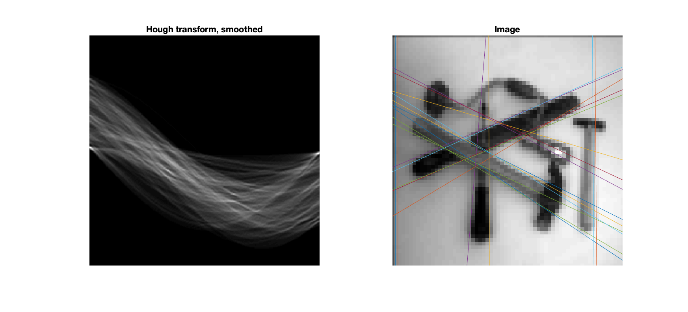

# Answers to questions in Lab 2: Edge detection & Hough transform

**Name:** Jonathan Rintala                                                       					**Program:** TIEMM, MAIG


**Instructions**: Complete the lab according to the instructions in the notes and respond to the questions stated below. Keep the answers short and focus on what is essential. Illustrate with figures only when explicitly requested.

Good luck!

---


## 1. Difference operators

**Question 1**: What do you expect the results to look like and why? Compare the size of *dxtools* with the size of *tools*. Why are these sizes different? 

**Answers:**

*dxtools:* Will show fluctuations in derivative on x-axis. Thus, there would be more clear edges facing horizontally here. | | |

*dytools:* Will show fluctuations in derivative on y-axis. Thus, there would be more clear edges facing vertically here. ===

Since we use the sobel operator, with the two 3x3 kernels:


These two kernels are convolved with the image, and by we will thus get one approximation of the horizontal changes in derivative and one approx. of the vertical changes in derivative. The sobel operator smoothens the image by some amount, hence it is less susceptibel to noise (and is isotropic). Produces slightly thicker edges however - poorer edge localization. Roberts operator for instance, a bit thinner (better located) edges, could miss some edges - sensitive to noise.

Comparing the size of tools and dxtools:

```{matlab}
size(tools) = 256 256
size(dx_tools) = 254 254
```

Thus, we loose 2x2 pixels in size, when convolving the image with the Sobel kernels. The reason being, we cannot compute the approx of derivative at the edges. Thus, we pass in the 'valid'-parameter into the conv2.

```{matlab}
help conv2
/../
'valid' - returns only those parts of the convolution that are computed without the zero-padded edges. 
/../
```


---

**Question 2**: Is it easy to find a threshold that results in thin edges? Explain why or why not! 

**Answers:**

- We plot a few different thresholds to try to visually determine a reasonable threshold, that produces thin edges, and this gives as a farily good chance to find appropriate thresholds.
- We also look at the histogram, with the different intensities represented and counts for them respectively, but no clear patterns, that can be used, are identified.
- Appropriate thresholds are often "valleys" of the histogram plotting counts of the different intensities. However, our histograms doesn't show any such trends.
- Adaptive thresholding could be an alternative - dividing the image into subimages, and using different thresholds for these => in order to get thin edges for all subimages, if they for example have uneven illumination accross the image.
- Main issue: the edges are of varying sharpness/depth => produces a derivative with varying magnitude (i.e. edge strength varies), thus if we have:
  - Low threshold:
    - Sharp edges are cut off earlier => become wider
    - Local maxima due to noise
  - High threshold:
    - Subtle edges might fade or break (become fragmented)


***Figure 2.1*** - Illustration of low and high thresholds on 

___________________________________________________________________________

**Question 3**: Does smoothing the image help to find edges? 

**Answers:**

- To some extent smoothing/blurring definately helps, since it reduces all high freq noise, while preservning edges
- We have to use a substantially lower threshold than before (about 1/10), since the frequencies are lowered (high frequencies surpressed since Gaussian is lowpass)


***Figure 3.1*** - Original image, looking at various thresholds


***Figure 3.2*** - Gaussian blurred/smoothened image with sigma 2, looking at various thresholds


***Figure 3.3*** - Gaussian blurred/smoothened image with a high sigma of 7, looking at various threshold


___________________________________________________________________________

**Question 4**: What can you observe? Provide explanation based on the generated images. 

**Answers:**

- Only look at magnitude for second and third derivative => therefore only look at denominator

- Gradient magnitude
  $$
  L_v = \vert \nabla L\vert = \sqrt {L_x + L_y}
  $$

- Defining the edges as:
  $$
  \tilde L_{vv} = L_v^2L_{vv} = L^2_xL_{xx}+2L_xL_yL_{xy} +L_y^2L_{yy} = 0 \\
  \tilde L_{vvv} = L_v^3L_{vvv} = L^2_xL_{xxx}+3L_x^2L_yL_{xxy} +3L_xL_y^2L_{xyy} +L_y^3L_{yyy} < 0
  $$

- Which will correspond to our two function files (Lvvtilde and Lvvvtilde)

- Then we define masks that correpsond to the discrete derivative approx of all partial derivatives up to the order of three.


***Figure 4.1*** - Lvv i.e. second order derivative of the smoothened intensity function L, on godthem256, varying sigmas

**Conclusions:**

A lot of lines, since there are many zero-crossings in the image, which means the second order derivative is shifting between negative and positive values, causing Lvv=0; not just where there are edges, but at other places as well. Smoothing the image => less of these zero-crossings. If we smoothen too much however, we loose detail and edges become distorted or do not follow the actual edges with precision.

___________________________________________________________________________

**Question 5**: Assemble the results of the experiment above into an illustrative collage with the *subplot* command. Which are your observations and conclusions? 

**Answers:**

*Effect of sign condition - 3rd order derivative in the gradient direction:*

- The white areas correspond to edges and pixels with Lvvv < 0 i.e. negative third order derivatives in the gradient direction
- The result is images where we can see the contours fairly well, however they are not as clear as for the second derivative
- Low scale/sigma value => detailed image, with lots of white, and black dots around the white contours
- High scale/sigma value => smoothened image (blurry), where edges are wide, but are more emphasized if scale/sigma is not set too high


***Figure 4.2*** - Lvvv i.e. third order derivative of the smoothened intensity function L, on few256, varying sigmas


___________________________________________________________________________

**Question 6**: How can you use the response from *Lvv* to detect edges, and how can you improve the result by using *Lvvv*? 


**Answers:**

Both functions perform well on their own, but are not really perfect individually, since they only check one of the criteria for an edge each. When we combine the two functions, we enforce both criteria of an edge, and thus only show the pixels where these are fulfilled: which means Lv is a maximum when Lvv = 0, since also Lvvv should be negative. I.e. the gradient magnitude reaches a local max where both these criteria are met.

<u>Conclusion:</u>

- "No" incorrect edge detections x are made, at least fewer such.


___________________________________________________________________________

**Question 7**: Present your best results obtained with *extractedge* for *house* and *tools*. 

**Answers:**

After some experimentation, testing different parameter values, the best results are obtained by:

- <u>few256:</u> scale 4 and threshold 8
- <u>godthem256:</u> scale 4 and threshold 4


***Figure 7.1*** - few256 with scale 4, varying threshold between 2 and 12


***Figure 7.2*** - few256 zoomed in


***Figure 7.3*** - godthem256 with scale 4, varying threshold between 2 and 12


___________________________________________________________________________

**Question 8**: Identify the correspondences between the strongest peaks in the accumulator and line segments in the output image. Doing so convince yourself that the implementation is correct. Summarize the results of in one or more figures. 

**Answers:**


***Figure 8.1 and 8.2*** - Edge lines from Hough transform on geometrical shapes




***Figure 8.3 and 8.4*** - Edge lines for few256 and subsampled few256

Figure 8.3 and 8.4 shows us it's OK just to look at subset of image. There are still plenty of dots on a line, so edges will still be detected.


***Figure 8.5 and 8.6*** - Displaying godthem256 and phonecalc256 with overlaycurves

___________________________________________________________________________

**Question 9**: How do the results and computational time depend on the number of cells in the accumulator? 

**Answers:**

When running the computations for a few different numbers of thetas resp rhos, the results where:

| ID   | No of $\theta$ | No of $\rho$ | Avg. time |
| ---- | -------------- | ------------ | --------- |
| I    | 160            | 160          | 4380.50ms |
| II   | 160            | 1600         | 4384.08ms |
| III  | 1600           | 160          | 4389.34ms |

<u>Conclusion:</u>

- The number of thetas affects the computational time to a higher extent, than the number of rhos.
  - This, because we in each point has to look at lines for each different angle theta.
- However, increasing eather of the parameters increase the computational time, since more computations have to be performed, as the matrix increases.
  - Also, more lines around the distinct/sharp edges (localmax there)
  - I.e. located in one part of the accumulator space
- A high theta reflects in the pattern of edges detected; we detect many edges close to each other, because these gets the highest vote, and become slight variations of essentially the same edge. Thus, we get a better representation of edges in the image overall if these similar edges gets "grouped" to the same theta.
  - In order, to us having to increase the number of lines in some sense, to include the sought after edges as well
- When decreasing the number of cells i.e. params, we get:
  - Faster computation time
  - Less accurate direction of lines/edges OR placement if number of rhos is reduced


___________________________________________________________________________

**Question 10**: How do you propose to do this? Try out a function that you would suggest and see if it improves the results. Does it?

**Answers:**

Basic idea is to introduce weight for vote, instead of just assuming a vote is worth 1. The weights are defined with a few different functions, all increasing, in order to weigh the votes according to the strength of magnitude of the gradient in that point.

- voting(grad_magnitude) = log(grad_magnitude), gives us results that are close to the original case where we have voting(x) equal to 1

  - Because of its properties, log will reduce the difference between high/low intensities or gradient magnitudes => which increases the chance of edges with lower values

  

  ***Figure 10.1*** - voting-function set to log(grad_magnitude)

- In addition, the function voting(grad_magnitude) = grad_magnitude^3 is tested. However, it seems this function introduces too much weight on the strongest edges => and thus, since it doesn't overperform a uniform weight of 1, is not suitable.


***Figure 10.2*** - voting-function set to grad_magnitude^3


___________________________________________________________________________

 

 

 

 