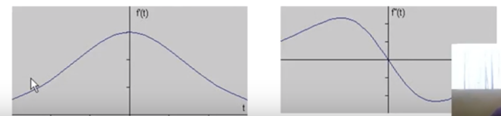

# Lab 2 - Comments

**Goal of lab:**

- Understand how differential geometry based edge detection and the Hough transform works
- Gain practical experience in applying these operations to real data
- Learn the characteristics of the methods - ex. how important choice of scale is for edge detection

**Q2:**

- Why do we define our own masks dxmask, dymask for the second image 'godthem256'?
  - "The work is facilitated considerably if you write a matlab procedure pixels.."
- Why if we have high threshold?
  - high threshold -> mild edges break or fade
  - Shouldnt it just include the entire peak then, with all info

**How hough transform works:** (GREAT VIDEO FOR INTUITION)

https://www.youtube.com/watch?v=4zHbI-fFIlI

- Find aligned points in images that create lines

  - Input image
  - Edge image
  - Detected lines

- Suppose a line, ex: y = ax+b

- One way of extracting thin edges is by considering points for which the gradient magnitude reaches local maxima in gradient direction. As it has been mentioned during the lectures, this edge definition can be expressed in differential geometry terms as the 

  - second order derivative being equal to zero 
  - the third order derivative being negative.

- Introduce in each point a local coordinate system (u, v) such that the v direction is parallel to the gradient direction and the u direction is perpendicular to this. Then an edge can be defined as:

  􏰚 Lvv =0, Lvvv < 0

- **Why is edge detetion useful?**

  - Important faetures can be extracted from the edges of an image (corners, lines, curves, etc)

  - These features can be used by higher-level computer vision alogrithms (ex. recognition of objects etc.)

- **Modeling intensity changes:**

  - step edge: the intensity of image abruptly changes from one value (on one side of the discontinuity) => another value (on opposite side)

- **Calculating the gradient magnitude and direction:**
  - https://www.youtube.com/watch?v=j7r3C-otk-U

- **Q6:**

  - Why is noise not showing both the properties of Lvv=0 and Lvvv<0?
    - Why does a change show both?

- **Q7:**

  - Essentially find best combo of scale and threshold

    - What becomes problem with having too high threshold?

- **Second order derivative methods:**

  https://www.youtube.com/watch?v=aJc8p3Eh0pA

  zero crossing of the second order derivative of a function indicates the presence of a maxima

- Laplacian
- Mask 3x3
  - very susceptible to noise, filtering required, use of Laplacian of Gaussian

hough

https://www.youtube.com/watch?v=ebfi7qOFLuo

### q8 - we cap number of rhos for ex.

- This means we will have to take the closest one, we dont always get a perpendicular one?
- Problematic?