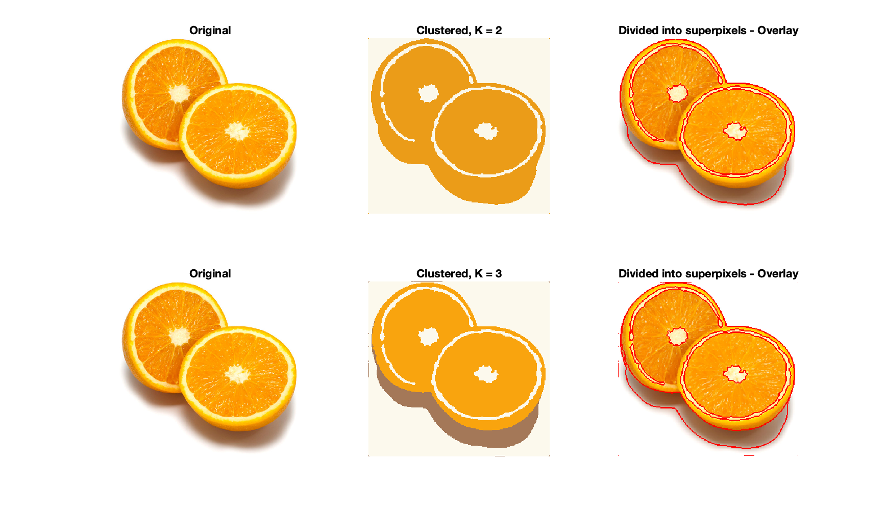
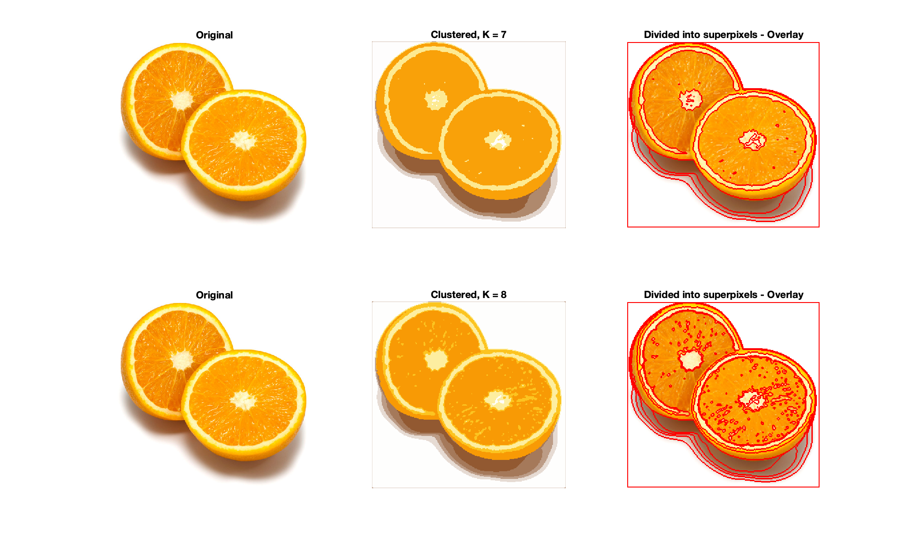
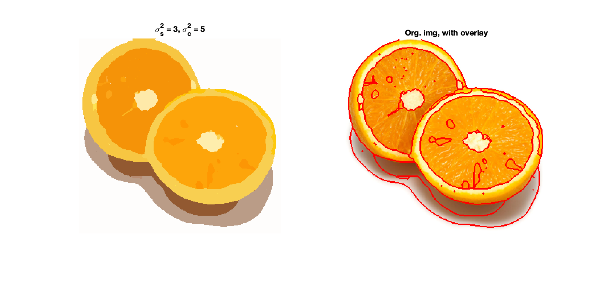
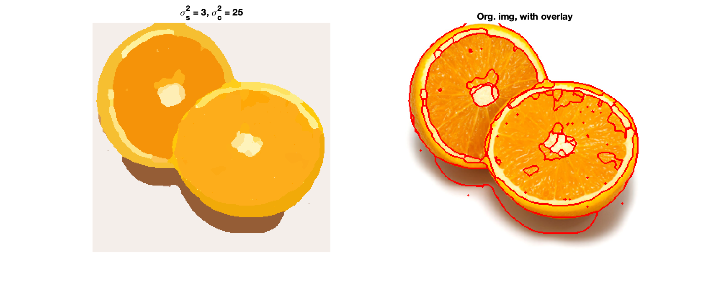
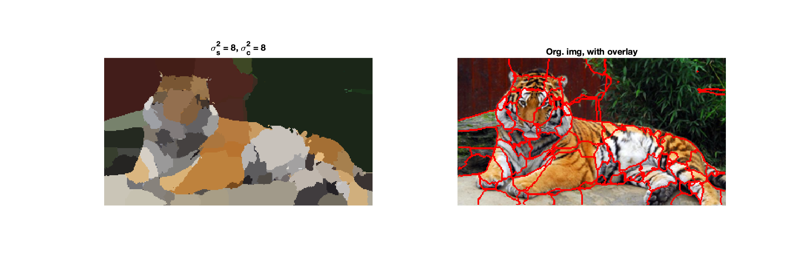
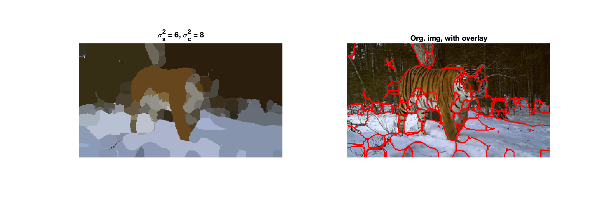
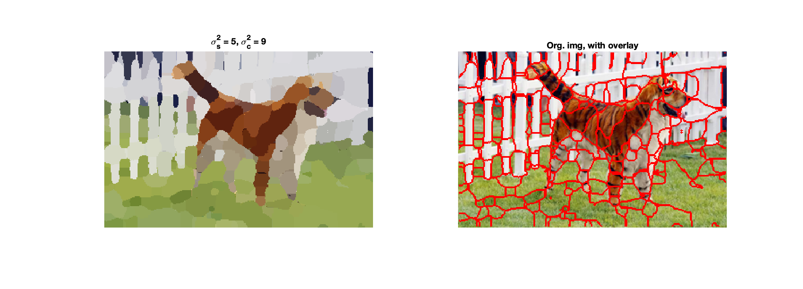

# Answers to questions in Lab 3: Image segmentation

**Name:** Jonathan Rintala                                                       					**Program:** TIEMM, MAIG

**Instructions**: Complete the lab according to the instructions in the notes and respond to the questions stated below. Keep the answers short and focus on what is essential. Illustrate with figures only when explicitly requested.

Good luck!

------

## 2. K-means clustering

**Question 1**: How did you initialize the clustering process and why do you believe this was a good method of doing it?

**Answers:**

<!-- TODO: Answer -->

---

**Question 2**: How many iterations L do you typically need to reach convergence, that is the point where no additional iterations will affect the end results? 

**Answers:**

<!-- TODO: Answer -->

<!-- TODO: insert some table here of convergence comparison -->

- Setting UNTIL_CONVERGENCE = TRUE

---

**Question 3**: What is the minimum value for K that you can use and still get no superpixel that covers parts from both halves of the orange? Illustrate with a figure.

**Answers:**

We can observe quite the substantial variation between the runs. However, when setting a K=8, i.e. having 8 centers of clusters, we can distinguish the two halves most of the times, since it, in those cases, doesn't exist any such superpixel that covers both halves, which gives the overly simplified interpretation of them belonging to the same segment/cluster.

***Fig. 3.1*** - K-means clustering with k=2 & k=3

***Fig. 3.2.*** - K-means clustering with k=7 & k=8

---

**Question 4**: What needs to be changed in the parameters to get suitable superpixels for the tiger images as well?

**Answers:**

It's evident the tiger images are of a more complex structure, with finer details and color variations. Followingly, we have to increase the amount of clusters to represent this more complex nature, as well as increase the number of iterations (L), in order to reach convergence.

---

##3. Mean-shift segmentation

**Question 5**: How do the results change depending on the bandwidths? What settings did you prefer for the different images? Illustrate with an example image with the parameter that you think are suitable for that image.

**Answers:**

*The spatial bandwidth:* A high spatial variance/bandwidth means the unicolor areas will be larger. The number of modes and number of modes will decrease, as we increase the spatial bandwidth. The reason being, more pixels are included in the mean calculation, since our interest region is larger.

*The colour bandwidth:* A high colour variance/bandwidth means the image will be smoothened to a higher degree. The bandwidth determines the radius for the colour space.

***Fig. 5.1*** - Testing different colour bandwiths on the image of orange halves

***Fig 5.2*** - Tiger1 image with mean-shift segmentation applied, using suitable bandwidths

***Fig 5.3*** - Tiger2 image with mean-shift segmentation applied, using suitable bandwidths

***Fig 5.4*** - Tiger3 image with mean-shift segmentation applied, using suitable bandwidths

---

**Question 6**: What kind of similarities and differences do you see between K-means and mean-shift segmentation?

**Answers:**

- *Differences:*
  - K-means do not consider any spatial information, only colour info, meaning the position of the pixels, but mean-shift take this into account as well
  - K-means needs a pre-specified number of clusters, whereas mean-shift will find a number of modes, but needs pre-specified bandwidth
  - K-means has a high sensititivity to outliers, whereas mean-shift is less affected by them
- *Similarities:*
  - Both methods are iterative to their nature.
    - K-means will update it's cluster center, according to the mean colour.
    - Mean-shift will update it's position, according to where the maximum of local density is located.
  - Both methods are used for segmenting images, and treat colour and pixels as samples from a prob. distrib.

---

## 4. Normalized Cut

**Question 7**: Does the ideal parameter setting vary depending on the images? If you look at the images, can you see a reason why the ideal settings might differ? Illustrate with an example image with the parameters you prefer for that image.

**Answers:**

The ideal params definitely depend on the image they are applied to. The functionality/control that each of the parameters holds:

- **ncuts_thresh** - Decides max cutting cost that we allow, which translates to how similar areas we allow to cut/separate. Larger value of ncuts_thresh means more similar areas will be OK to separate apart.
- **min_area** - Sets min. limit on how small areas/segments are allowed.
- **max_depth** - Sets the amount of recursive calls that are made i.e. the amount of cuts that will be made. If we increase max_depth, we will get more segments.

- **color_bandwidth** - This param affects how similar pixels are weighted.
  - Low bandwidth => large weights for similar pixels and low weigths for unsimilar pixels
  - High bandwidth => flattening the Gaussian - decreasing the weight for similar pixels and increasing weight for unsimilar pixels => affects cost of cut and segmentation
- **radius** - Decides the size of the neighbouring area of a pixel. A larger radius will include pixels even further away into account, and result in fewer segments; this, however, increases time complexity.

Key take-aways are:

- If we reduce max_depth on images containing complex structures, we achieve bad results
- If we get an image with lots of complexity, ncuts_thresh has to be increased - like for example the tiger vs. orange
- Max_depth could be increased in order to increase the amount of cuts that will be made, however it was kept unchanged during these tests, and thus did not affect any 

<!-- INSERT IMAGES HERE -->

---

**Question 8**: Which parameter(s) was most effective for reducing the subdivision and still result in a satisfactory segmentation?

**Answers:**

The most effective parameters to reduce the subdivision and still result in satisfactory results of segmentation was:

- max_depth
- ncut_thresh
- min_area

---

**Question 9**: Why does Normalized Cut prefer cuts of approximately equal size? Does this happen in practice? 

**Answers:**

There is a theoretical reason behind this. 

Since assoc(Sub,V) includes all the edges that are connecting any vertices in the subset Sub, we have, for the entire set V:
$$
assoc(V) = assoc(A,V) + assoc(B,V) - cut(A,B) \quad (i)
$$
where we subtract the cut(A,B) i.e. the sum of edges that connect two vertices in A and B respectively.

We rewrite this expression and isolate assoc(B,V):
$$
assoc(B,V) = assoc(V) - assoc(A,V) + cut(A,B) \quad (ii)
$$

We also have our expression for Ncut(A,B) as:
$$
Ncut(A,B) = \frac{cut(A,B)}{assoc(A,V)} + \frac{cut(A,B)}{assoc(B,V)} \quad (iii)
$$

Then, given the expression for Ncut(A,B), we can substitute our expression for assoc(B,V) (ii):
$$
Ncut(A,B) = \frac{cut(A,B)}{assoc(A,V)} + \frac{cut(A,B)}{assoc(V)-assoc(A,V)+cut(A,B)} \quad (iv)
$$

Since our goal is to minimize Ncut(A,B) we can take the derivative of our expression of Ncut(A,B) (iv) and set it to 0:
$$
Ncut(A,B) = \frac{cut(A,B)}{assoc(A,V)} + \frac{cut(A,B)}{assoc(V)-assoc(A,V)+cut(A,B)} = \\\{Wolfram Alpha\} => \\
\frac{\delta Ncut(A,B)}{\delta assoc(A,V)} = \frac{cut(A,B)(assoc(V)+cut(A,B))(-2assoc(V)+cut(A,B))}{assoc(A,V)^2(assoc(V)-assoc(A,V)+cut(A,B))^2} = 0 \quad (v)
$$

We then simply this expression for the derivative in (v):
$$
-2assoc(A,V) + assoc(V) + cut(A,B) = 0 \\
=>\\
2assoc(A,V) = assoc(V)+cut(A,B)=> assoc(A,V) = 1/2(assoc(V)+cut(A,B))
\\=> \{substituting \space (i)\} => \\
assoc(A,V) = 1/2(assoc(A,V)+assoc(B,V)-cut(A,B)+cut(A,B)) \\= 1/2(assoc(A,V)+assoc(B,V))  \\=>\\
1/2assoc(A,V) = 1/2 ssoc(B,V) => assoc(A,V) = assoc(B,V)
$$

In practice this happen if we only look at maximum depth, then the image gets cut into two equally proportional segments; however, when we introduce the other params, the proportionality will be different.

----

**Question 10**: Did you manage to increase *radius* and how did it affect the results? 

**Answers:**

When we increase radius, the time of computation increases quite vastly, since we then incorporate more of the neigbouring pixels into the calculations. The results show, as expected, larger segments. However, the colours seem to be slightly off.

---

## 5. Segmentation using graph cuts

**Question 11**: Does the ideal choice of *alpha* and *sigma* vary a lot between different images? Illustrate with an example image with the parameters you prefer.

**Answers:**

*alpha* - the maximum cost of an edge

- When we increase alpha, we lower the maximum cost of an edge, which results in it becoming easier to cut strong edges.

*sigma* - how much the cost decays for decreasing similarity between neighbouring pixels

- When we increase sigma, a decrease in similarity from neighbouring pixels, will mean cost decays even more, resulting in more simplified cuts

If we lower both parameters, our cuts become more sensitive and the accuracy of segmentation decreases, since we will be more ok with separating/cutting similar pixels (with high edge values).

<!-- TODO: RELATE TO PICS AND ACTUAL VALUES/RANGES -->

<!-- TODO: INSERT IMAGES -->

---

**Question 12**: How much can you lower K until the results get considerably worse? 

**Answers:**

A K value of 3 is still OK, i.e. using 3 Gaussian components, fewer than that results in a worse performance and segmentation.

<!-- TODO: INSERT IMAGES -->

---

**Question 13**: Unlike the earlier method Graph Cut segmentation relies on some input from a user for defining a rectangle. Is the benefit you get of this worth the effort? Motivate! 

**Answers:**

It definitely depends on the picture i.e. context that the algorithm is applied to. If, there is some clear object that can be surrounded by the bounding rectangle, that will help the accuracy of the segmentation by more specifically defining a representative training set. However, in many cases there might not be one specific object, rather a mix of foreground and background, like for instance in a landscape image, then a bounding rectangle will be of no help.

---

**Question 14**: What are the key differences and similarities between the segmentation methods (K-means, Mean-shift, Normalized Cut and energy-based segmentation with Graph Cuts) in this lab? Think carefully!! 

**Answers:**

The different methods for image foreground-background segmentation:

1. K-means
2. Mean-shift
3. Normalized Cut
4. Energy-based segmentation with Graph Cut

**Similarities:**

- All the methods use clustering to group affinite points of data (mainly based on similarities in colour)
- All the methods do segmentation with the goal of grouping similar parts of the image together in one cluster, and non-similar parts of the image into other clusters
- Mean-shift and Graph Cut both use the Gaussian distribution to model data
- Both of Normalized Cut and Graph Cut are graph-based i.e. they look at the image as a graph, with vertices and edges connecting them, based on some similarity measure

**Differences:**

- Graph Cut is essentially the only model that need prior information about the expected ratio of foreground/background (in order to produce more accurate results), whereas Normalized cut does not need any such information
- Mean-shift (and the Graph-based methods) does take spatial information into account, whereas K-means does not and only looks at the colour dimension
  - This causes K-means to often result in segments which go across areas that are separated

---

 

 