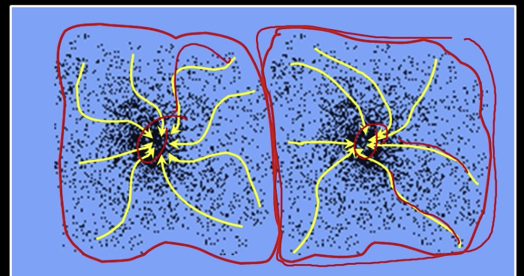

# Comments lab3

- Iterations

  - Many times 20-30 iterations ok

- Questions encourage exploring the areas - hard to give exact answers

- Important - how different methods work themselves, weaknesses, when use one and another

  - How do we set the different parameters?
    - If change this param => this happens
    - Some relations - but not crystal clear

- Delad apelsin är svår

- Färg som avgör superpix?

  - boundary?
  - Where do we use "seed" in kmeans_segm?

- **K-means**

  - not labeled training data - only data => split in three ex.

  - K determines how many splits we split it into

  - Number of K's dependent on situation (our image)

  - A certain K could lead to oversplitting in some situations, in others not

  - Run K-means a few times, with different starting positions => get better split

  - Sometimes instead of random - we pick to points

    - If we pick bad points => could be a problem
    - K-means ++
    - If randomization chooses point along same line, but further away, it will just take longer to converge

  - **General idea:** 

    - We have an initial guess on how to separate the data
    - We separate it 
    - Re-calculate centers of those regions
    - Repeat process - try to converge on a good separation

  - Move points into one of the two regions => recalculate the centers

  - Will tell us => which pixels belongs to what classes, but also what are the colors of those classes

  - IF we want to compress image - split into K-clusters - 16 - will pick those dominant colors

- **Mean Shift Clustering**
  - https://www.youtube.com/watch?v=Evc53OaDTFc
  - https://www.youtube.com/watch?v=yhz8Fm0ymm8
  - Cluster: all data points in the attraction basin of a mode
  - Attraction basin: the region for which all trajectories lead to the same mode

  

- Find features (color, gradients, texture, etc.)
- Intialize windows at individual feature points (pixels)
- Perform

- Kernel is given by Gaussian function K(\hat x)

- And the variance is given by a diagonal matrix D, with separate variances (bandwiths) for image position (spatial_bandwith) and for colours (color_bandwith)
  $$
  D = diag(\sigma^2_s,\sigma^2_s,\sigma^2_c,\sigma^2_c,\sigma^2_c)
  $$

  **Idea of mean-shift:**

  - first create superpixels with k-means

  - for each superpixel, do trajectory => then go towards its modes

  - find the common modes for the superpixels

- Increasing variance/bandwidth for color => will give surrounding colors more impact when deciding the color of the pixel - i.e. "more blurred"

- Increasing variance/bandwith for position => will give surrounding pixel's colours more impact when deciding the color of the pixel

**4. Normalized Cut**

**5. Graph cuts"**

- https://www.youtube.com/watch?v=HMGX8HXskKk
  - Foreground (source)
  - Background (sink)
  - Connect every pixel of the image (get a node) connect it to source, with probability of being foreground, and connect to sink, with the probability of being background

- Use info from the descriptors
- Connect every pixel to the source & sink
- Then connect each pixel to its neighbours - left/right/maybe diagonals (4 or 8 neighbourhood) - with certain weight
  - These weights should help us, and promotes pixels that are particularly proned to stay together (should promote similar pixels to stay together)
  - Weights could be set, that are proportional to gradient, or such similar measures
- When we have graph - we should partition that graph
  - Cut foreground from weak nodes
  - Cut background from weak nodes
- **Cut**: separating source and sink
  - Penalty: collection of edges
- **Min cut**: 
  - Global minimal energy in polynomial time
- Go through edges that says that pixels should stay together, and cut the weak ones
- Two step process:
  - 1. Produce/construct the graph with image processing information
    2. Cut the graph
  - 

